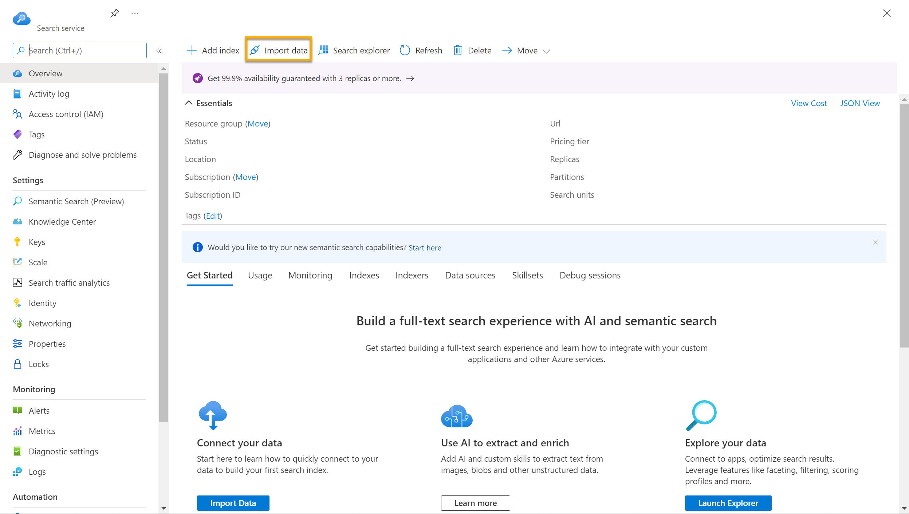

# projeto_2-dio-ai
## Buscas Cognitivas , utilizando o AI search para indexação e consulta de Dados

Neste LAB, exploraremos a organização de documentos e a pesquisa eficiente por meio da ingestão de dados, criação de índices e exploração de funcionalidades, obtendo uma visão prática da mineração de conhecimento.
A seguir deixo uma passo a passo de como configuramos o Laborátorio seguindo instruções da documentação da Microsoft.

## Recursos do Azure necessários
A solução que criamos para o Fourth Coffee requer os seguintes recursos na assinatura do Azure:

- Um recurso do Azure AI Search , que gerenciará a indexação e a consulta.
- Um recurso de serviços de IA do Azure , que fornece serviços de IA para habilidades que sua solução de pesquisa pode usar para enriquecer os dados na fonte de dados com insights gerados por IA.

Observação: os recursos do Azure AI Search e dos serviços do Azure AI devem estar no mesmo local!

- Uma conta de armazenamento com contêineres de blobs, que armazenarão documentos brutos e outras coleções de tabelas, objetos ou arquivos.

  
1. Acesse o portal do Azure e clique em + Criar um recurso.
2. Pesquise Azure AI Search e crie um recurso com as configurações:
- Assinatura: sua assinatura do Azure.
- Grupo de recursos: selecione ou crie um exclusivo.
- Nome do serviço: um nome único.
- Localização: qualquer região disponível (exemplo: East US 2).
- Nível de preço: Básico.
3. Clique em Revisar + Criar e, após a validação, selecione Criar.
4. Após a implantação, clique em Ir para o recurso para gerenciar índices e importar dados.

  
## Criar um recurso de serviços de IA do Azure
1. No portal do Azure, clique em + Criar um recurso e pesquise Azure AI Services.
2. Selecione Criar um plano de serviços do Azure AI e configure com:
- Assinatura: sua assinatura do Azure.
- Grupo de recursos: o mesmo do Azure AI Search.
- Região: igual à do Azure AI Search.
- Nome: um nome único.
- Nível de preço: Standard S0.
- Marque a opção de reconhecimento dos termos.
3. Clique em Revisar + Criar e, após a validação, selecione Criar.
4. Aguarde a implantação e visualize os detalhes.

  
## Criar uma conta de armazenamento no Azure
1. No portal do Azure, clique em + Criar um recurso e pesquise Conta de Armazenamento.
2. Configure com:
- Assinatura: sua assinatura do Azure.
- Grupo de recursos: o mesmo do Azure AI Search e Azure AI Services.
- Nome da conta: um nome único.
- Localização: qualquer disponível.
- Desempenho: Padrão.
- Redundância: LRS (Armazenamento Redundante Local).
3. Clique em Revisar + Criar e depois em Criar.
4. Após a implantação, vá para o recurso, acesse Configuração no menu esquerdo e habilite Permitir acesso anônimo do Blob, depois Salvar.

## Carregar documentos para o armazenamento do Azure
  
1. No portal do Azure, acesse Contêineres no menu esquerdo.
2. Clique em + Container e configure:
- Nome: coffeereviews
- Nível de acesso público: Container (acesso de leitura anônimo)
- Avançado: sem alterações
- Clique em Criar.
3. Baixe e extraia os arquivos das avaliações de café de este link.
4. Em uma nova aba do navegador, baixe as avaliações de café compactadas de https://aka.ms/mslearn-coffee-reviewse extraia os arquivos para a pasta de avaliações .
5. No Azure, acesse o contêiner coffee-reviews e clique em Upload para enviar os arquivos.

## Indexar os documentos no Azure AI Search
  
1. Acesse o Azure AI Search e clique em Importar dados.
2. Conectar aos dados:
- Fonte de dados: Azure Blob Storage
- Nome da fonte: coffee-customer-data
- Dados a extrair: Conteúdo e metadados
- Modo de análise: Padrão
- String de conexão: Escolha uma conexão existente, selecione a conta de armazenamento e o contêiner coffee-reviews.
- Descrição: Avaliações das cafeterias Fourth Coffee
- Clique em Avançar.
3. Adicionar habilidades cognitivas:
- Selecionar recurso de IA do Azure.
- Nome do Skillset: coffee-skillset.
- Habilitar OCR e mesclar texto no campo merged_content.
- Dados de origem: merged_content.
- Granularidade: Páginas (blocos de 5000 caracteres).
4. Selecionar campos enriquecidos:
- Localizações (Extrair nomes de localização).
-Frases-chave (Extrair frases-chave).
- Sentimento (Detectar sentimento).
- Tags de imagem (Gerar tags de imagens).
- Legenda da imagem (Gerar legendas de imagens).
5. Salvar enriquecimentos em um armazenamento de conhecimento:
- Criar um contêiner knowledge-store com nível Privado.
- Selecionar o contêiner para armazenamento de conhecimento.
6. Personalizar índice de destino:
- Nome do índice: coffee-index.
- Chave: metadata_storage_path.
- Selecionar filtrável para os campos: content, locations, keyphrases, sentiment, merged_content, text, layoutText, imageTags, imageCaption.
Finalizar e criar o índice.

## Criar e executar o indexador
  
1. Clique em Avançar: Criar um indexador.
2. Nome do indexador: coffee-indexer.
3. Programação: Defina como Uma vez.
4. Opções Avançadas:
- Certifique-se de que Base-64 Encode Keys está ativado.
5. Clique em Enviar para criar a fonte de dados, conjunto de habilidades, índice e indexador.
## Execução do indexador
- O indexador processa os dados, extraindo metadados e aplicando habilidades cognitivas.
- No Azure AI Search, vá para Indexers e selecione coffee-indexer.
- Aguarde um minuto e clique em ↻ Refresh até que o Status indique sucesso.
- Clique no nome do indexador para visualizar os detalhes.

## Conclusão
Após essas, configurações conseguimos agora realizar as consultas e concluímos que o processo de criação e exploração de um índice no Azure AI Search oferece uma solução poderosa para mineração de conhecimento. Ele permite que empresas, como a Fourth Coffee, analisem avaliações de clientes e extraiam insights valiosos para melhorar a experiência do consumidor.
Podemos tambem destacar alguns pontos como:
- A mineração de dados impulsionada por IA permite decisões estratégicas mais embasadas.
- A automação do processamento reduz tempo e custos operacionais.
- A integração com IA abre oportunidades para análises preditivas e recomendações personalizadas.
Esse tipo de solução pode transformar a maneira como empresas lidam com grandes volumes de dados, tornando as informações mais acessíveis e acionáveis.

## Pontos-chave
- Criação de recursos no Azure: Inclui AI Search, serviços de IA e armazenamento de dados.
- Indexação e enriquecimento de dados: Uso de habilidades cognitivas para extrair informações relevantes.
- Consultas e análise: Utilização do Search Explorer para buscas refinadas por localização, sentimento e frases-chave.
- Repositório de conhecimento: Estruturação e visualização dos dados enriquecidos.

## Ferramentas beneficiadas
- E-commerce e atendimento ao cliente: Melhor entendimento do feedback dos usuários.
- Saúde e finanças: Análise de documentos e extração de informações críticas.
- Mídia e entretenimento: Organização e pesquisa eficiente de conteúdos multimídia.

## Fonte
https://microsoftlearning.github.io/mslearn-ai-fundamentals/Instructions/Labs/11-ai-search.html#upload-documents-to-azure-storage
